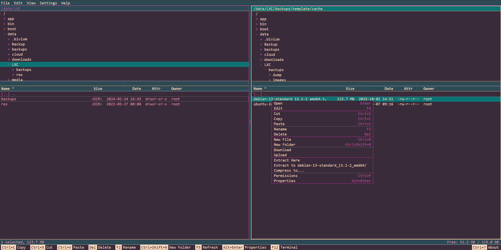

# Bivium

A web-based dual-panel file manager inspired by Norton Commander and Midnight Commander. Built with Blazor Server on .NET 10, styled with [WebTUI](https://github.com/nicholasgasior/webtui) to look like a classic terminal application.

Runs on Linux, Windows and macOS. Accessible from any browser.



## Features

**Dual-panel navigation** with synchronized directory trees, editable path bars with autocomplete, sortable file lists (name, size, date, attributes, owner), and full keyboard-driven operation.

**File operations** — copy, cut, paste, move, rename, delete, create files and folders. Drag and drop upload with chunked transfer (up to 50 MB per chunk). Download files or entire directories as ZIP.

**Built-in editor** powered by Monaco Editor with syntax highlighting for 40+ file types, including common languages (C#, Python, Go, Rust, TypeScript, etc.) and configuration formats (JSON, YAML, Dockerfile, etc.).

**Built-in terminal** (F12) with full shell emulation via xterm.js. Spawns the native shell of the host system.

**Archive support** — extract and create archives in ZIP, TAR, TAR.GZ, TAR.BZ2, TAR.XZ and TAR.ZST formats, with progress tracking.

**Permissions management** — view and edit file permissions. Shows Unix modes on Linux/macOS and RHSA attributes on Windows.

**Properties inspector** — file metadata, recursive directory size calculation with file/folder count.

## Keyboard shortcuts

| Key | Action |
|---|---|
| Tab | Switch active panel |
| Enter | Open directory or file |
| Backspace | Go to parent directory |
| F2 | Rename |
| F4 | Edit in Monaco editor |
| F5 | Refresh panel |
| F12 | Toggle terminal |
| Del | Delete |
| Ctrl+N | New file |
| Ctrl+Shift+N | New folder |
| Ctrl+C / X / V | Copy / Cut / Paste |
| Ctrl+A | Select all |
| Ctrl+P | Permissions |
| Alt+Enter | Properties |
| Shift+Up/Down | Extend selection |
| PageUp / PageDown | Scroll by page |
| Home / End | Jump to first / last entry |
| Shift+F10 | Context menu |

## Running with Docker

```yaml
services:
  bivium:
    image: draknodd/bivium:latest
    container_name: bivium
    restart: unless-stopped
    user: "1000:1000"
    ports:
      - "5000:5000"
    environment:
      - BIVIUM_PORT=5000
      - BIVIUM_HOME=/data
    volumes:
      - /srv:/data:rw
```

Then open `http://your-host:5000` in your browser.

### Configuration

| Variable | Default | Description |
|---|---|---|
| `BIVIUM_PORT` | `5000` | Port the web server listens on |
| `BIVIUM_HOME` | `/data` | Initial directory shown in both panels |

The `user` directive controls which UID/GID the process runs as inside the container. Set it to match the owner of the directory you're mounting, otherwise you'll get permission errors. For example, if `/srv` is owned by root, use `"0:0"`.

The `volumes` entry maps a host directory into the container. In the example above, `/srv` on the host becomes `/data` inside the container, which is where `BIVIUM_HOME` points to.

To change the port to 8080:

```yaml
ports:
  - "8080:8080"
environment:
  - BIVIUM_PORT=8080
```

Both values must match — the first is the host port, the second is the container port where Bivium actually listens.

## Running standalone

Requires the [.NET 10 runtime](https://dotnet.microsoft.com/download/dotnet/10.0).

```bash
dotnet Bivium.dll
```

Optional flags:

```bash
dotnet Bivium.dll --port 8080
```

Or via environment variable:

```bash
export BIVIUM_PORT=8080
export BIVIUM_HOME=/home/user
dotnet Bivium.dll
```

When no `BIVIUM_HOME` is set, the panels default to the current user's home directory.

## Building from source

```bash
dotnet publish Bivium/Bivium.csproj -c Release -o dist
```

To build the Docker image:

```bash
docker build -t bivium .
```

## Dependencies

- [SharpCompress](https://github.com/adamhathcock/sharpcompress) 0.47.0 — archive format support
- [ZstdSharp](https://github.com/oleg-st/ZstdSharp) 0.8.7 — Zstandard compression
- [Monaco Editor](https://microsoft.github.io/monaco-editor/) — file editor
- [xterm.js](https://xtermjs.org/) — terminal emulator
- [WebTUI](https://github.com/nicholasgasior/webtui) 0.1.6 — TUI-style CSS

## License

This project is licensed under the [GNU General Public License v3.0](LICENSE).
