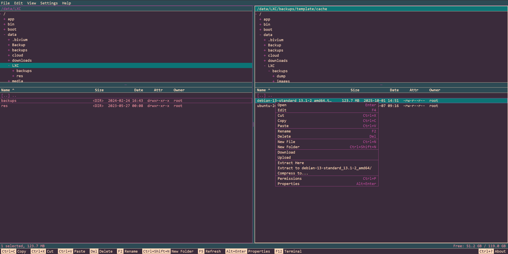

<p align="center">
  
</p>

# Bivium File Manager

A web-based dual-panel file manager inspired by Norton Commander and Midnight Commander. Built with Blazor Server on .NET 10, styled with [WebTUI](https://github.com/nicholasgasior/webtui) to look like a classic terminal application.

Runs on Linux, Windows and macOS. Accessible from any browser.



## Features

**Dual-panel navigation** with synchronized directory trees, editable path bars with autocomplete, sortable file lists (name, size, date, attributes, owner), single panel mode (Ctrl+O), touch support with long-press context menu, and full keyboard-driven operation.

**Persistent workspace** — panel paths, sorting, cursor, selection, scroll position, expanded folders, panel layout and terminal-window state survive browser or network disconnections. Only one browser controls the workspace at a time; another browser can explicitly take over. The workspace is cleared when Bivium stops or restarts.

**File operations** — copy, cut, paste, move, rename, delete, create files and folders. Drag and drop upload with chunked transfer (up to 50 MB per chunk). Download files or entire directories as ZIP.

**Advanced Rename** (Ctrl+F2) — batch rename files with a composable stack of methods: find & replace (with regex), insert text at position, remove by position or pattern, change case (lower/upper/title on name, extension or both), new name with tag templates (`<Name>`, `<Ext>`, `<Inc:start:step:pad>`, `<Date:format>`, `<Folder>`, `<Rand:min:max>`), and trim characters. Live preview with conflict detection and two-pass rename to handle circular renames safely. Accessible from context menu or Edit menu when files are selected; selecting a single directory renames all files within it recursively.

**Built-in editor** powered by Monaco Editor with syntax highlighting for 40+ file types, including common languages (C#, Python, Go, Rust, TypeScript, etc.) and configuration formats (JSON, YAML, Dockerfile, etc.).

**Persistent built-in terminal** (F12) — terminal processes, tabs and up to 100 MB of output per tab survive browser and network disconnections while Bivium remains running. Long histories remain responsive and searchable.

**Archive support** — extract and create archives in ZIP, TAR, TAR.GZ, TAR.BZ2, TAR.XZ and TAR.ZST formats, with progress tracking.

**Optional local authentication** — single local administrator account stored in `appsettings.json`, configurable from the Settings menu. Supports password hashing, optional TOTP 2FA with QR code setup, persistent cookie sessions, and incremental failed-attempt delays up to permanent account disable.

**Permissions management** — view and edit file permissions. Shows Unix modes on Linux/macOS and RHSA attributes on Windows.

**Properties inspector** — file metadata, recursive directory size calculation with file/folder count.

## Keyboard shortcuts

| Key | Action |
|---|---|
| Tab | Switch active panel |
| Enter | Open directory or file |
| Backspace | Go to parent directory |
| F2 | Rename |
| Ctrl+F2 | Advanced Rename |
| F4 | Edit in Monaco editor |
| F5 | Refresh panel |
| F12 | Toggle terminal |
| Del | Delete |
| Ctrl+N | New file |
| Ctrl+Shift+N | New folder |
| Ctrl+C / X / V | Copy / Cut / Paste |
| Ctrl+A | Select all |
| Ctrl+O | Toggle single / dual panel |
| Ctrl+P | Permissions |
| Alt+Enter | Properties |
| Shift+Up/Down | Extend selection |
| PageUp / PageDown | Scroll by page |
| Home / End | Jump to first / last entry |
| Shift+F10 | Context menu |

## Advanced Rename

Advanced Rename applies an ordered stack of transformations to multiple filenames and shows the final result before changing anything on disk. Open it with Ctrl+F2, **Edit -> Advanced Rename...**, or the selection context menu.

The input set depends on the current selection:

- multiple selected files are included while selected directories are skipped;
- one selected directory includes every file below it recursively;
- one selected file opens the tool for that file only.

The live preview displays original and computed names. Changed names are highlighted, conflicts are shown in red, and invalid names are struck through. The status bar reports total files, changed files, conflicts and errors. Methods can be added more than once, reordered and removed; each method receives the output of the previous one.

### Rename methods

| Method | Behavior |
|---|---|
| Replace | Replaces plain text or a regular expression in the complete filename; regex replacement groups such as `$1` and `${name}` are supported |
| Add | Inserts text at a zero-based position in the name, counting either from the beginning or the end; the extension is preserved |
| Remove by position | Removes a character range from the name, optionally counting from the end |
| Remove by pattern | Removes every plain-text or regular-expression match from the name |
| New Case | Converts the name, extension or complete filename to lowercase, uppercase or title case |
| New Name | Rebuilds the complete filename from literal text and template tags |
| Trim | Removes a configured character set from the start, end or both edges of the name, extension or complete filename |

Replace and pattern removal can be case-sensitive or case-insensitive. Invalid regular expressions leave the preview name unchanged and display an error.

### New Name tags

| Tag | Value |
|---|---|
| `<Name>` | Original filename without its extension |
| `<Ext>` | Original extension after the final dot, without the dot |
| `<Folder>` | Name of the immediate parent directory |
| `<Inc:start:step:pad>` | Per-file counter with starting value, increment and minimum zero-padded width |
| `<Date:format>` | File modification date formatted with a .NET date pattern such as `yyyy-MM-dd` or `yyyyMMdd_HHmmss` |
| `<Rand:min:max>` | Random integer in the inclusive range; uniqueness is not guaranteed |

Tags and literal text can be combined, for example `<Folder>_<Name>_<Inc:1:1:3>.<Ext>` or `<Date:yyyy-MM-dd>_<Inc:1:1:2>.<Ext>`. Unknown tags remain literal so they are visible in the preview.

### Validation and execution

A conflict occurs when two files in the same directory would receive the same name. Comparison follows platform filesystem behavior: case-insensitive on Windows and case-sensitive on Linux. Empty names and platform-invalid characters are errors. The Rename button remains disabled until the stack contains at least one method, at least one name changes, and all conflicts and errors are resolved.

Renaming uses a two-pass operation so circular changes such as swapping two names are safe. On complete success the dialog closes and both panels refresh. If an operation fails, successfully staged files are rolled back to their original names and the dialog reports the result.

## Desktop workspace persistence

Bivium keeps one shared workspace for the entire time the application is running. Closing the browser, temporarily losing the network or using **File -> Exit** does not discard that workspace.

The following state is restored when a browser reconnects:

- current folders, sorting, cursor, selected files and scroll positions;
- expanded folders in the directory trees;
- active panel and single- or dual-panel layout;
- terminal-window visibility, size, position, order and focused tab;
- terminal tabs, running commands and available output history.

If a previously open folder is no longer available, Bivium safely returns that panel to its configured home directory.

### Closing terminals and clearing the workspace

A terminal process is stopped only when you:

- close its terminal tab and confirm;
- close the terminal window and confirm termination of all sessions;
- choose **File -> Reset Workspace...** and confirm;
- stop or restart Bivium.

Minimizing the terminal, logging out, closing the browser or losing the network leaves terminal processes running. **File -> Reset Workspace...** stops every terminal and clears the saved panel and window state.

The workspace is stored only in the running Bivium process. Restarting the application, container or server stops every terminal and clears the workspace; sessions cannot be recovered after a restart.

### Using more than one browser

Only one browser can control the workspace at a time. A second browser shows who currently has control and offers a takeover action. After takeover, the previous browser becomes inactive and cannot modify files or send terminal input.

If the controlling browser disappears without disconnecting cleanly, control becomes available automatically after 90 seconds by default. Long-running operations notice a takeover and stop before beginning further work, but filesystem changes already completed are not automatically undone.

### Terminal history

Terminal output remains available when the browser disconnects. By default, Bivium keeps up to 100 MB for each terminal tab and 512 MB across all tabs. When a limit is reached, the oldest output is discarded first while the terminal process continues running.

You can search the retained history, select and copy text across long outputs, and continue reading older output while new lines arrive. Holding Shift forces text selection in terminal applications that use the mouse themselves.

### Advanced configuration

The default limits can be changed in `appsettings.json`. Find the `CommanderSettings` section, then edit the values inside its `TerminalRuntime` section:

| JSON option | Default | Meaning |
|---|---:|---|
| `MaxHistoryBytesPerTab` | 104857600 | Maximum output retained for one terminal tab (100 MB) |
| `MaxHistoryBytesGlobal` | 536870912 | Maximum output retained across all terminal tabs (512 MB) |
| `MaxTabs` | 16 | Maximum number of terminal tabs kept at once |
| `HistorySegmentBytes` | 262144 | Internal history block size; normally leave this unchanged |
| `HistoryPageRows` | 200 | Number of history rows loaded at a time |
| `HeadlessScrollbackRows` | 4096 | Recent rows kept immediately available while no browser is connected |
| `ExitedSessionRetentionHours` | 24 | Hours a completed terminal remains available for inspection |
| `ClientLeaseTimeoutSeconds` | 90 | Seconds before an unreachable controlling browser releases control |

## Running with Docker

Example `docker-compose.yml` — adjust volumes, environment variables and user to match your setup:

```yaml
services:
  bivium:
    image: draknodd/bivium:latest
    container_name: bivium
    restart: unless-stopped
    user: "1000:1000"
    ports:
      - "5000:5000"
    environment:
      - BIVIUM_PORT=5000
      - BIVIUM_HOME=/data
      - BIVIUM_DATA_DIR=/data/.bivium
    volumes:
      - /srv:/data:rw
```

Then open `http://your-host:5000` in your browser.

## Running standalone

Requires the [.NET 10 SDK](https://dotnet.microsoft.com/download/dotnet/10.0).

```bash
dotnet publish Bivium/Bivium.csproj -c Release -o dist
```

Then run the compiled binary:

```bash
./dist/Bivium --port 5000
```

The port can also be set via the `BIVIUM_PORT` environment variable. `BIVIUM_HOME` controls which directory the panels open on startup — when not set, it defaults to the current user's home directory.

`BIVIUM_DATA_DIR` controls where Data Protection keys are stored for authentication cookies. Set it to a persistent writable directory if authentication is enabled, otherwise existing browser sessions will be invalidated when keys are lost.

Closing a browser tab, using **File -> Exit** or losing the network does not terminate terminal processes. Use the terminal tab or window close controls to stop them, or choose **File -> Reset Workspace...** to stop every terminal and clear the saved workspace. Restarting Bivium or its container also stops every terminal; sessions cannot be recovered after a restart.

To build the Docker image:

```bash
docker build -t bivium .
```

## Authentication

Authentication is disabled by default and no user is created on first start. Open `Settings` -> `Authentication...` to create the single local administrator, enable or disable authentication, change credentials, and optionally configure TOTP 2FA.

Even when authentication is enabled, Bivium is not designed to be exposed directly to the public Internet. Run it on a trusted local network, behind a VPN, or behind infrastructure you control.

Bivium stores authentication settings in `appsettings.json`. Passwords are stored as hashes, and TOTP secrets are saved only when 2FA is enabled. Bivium must have permission to write to this file for changes made from the Settings menu to work.

Repeated failed login or verification attempts cause increasing delays and can eventually disable the account. To reset a permanently disabled account or forgotten 2FA setup, stop Bivium and open `appsettings.json`. Inside `CommanderSettings`, find `Authentication`: remove its `User` section to reset the account, or remove only `TwoFactor` to reset 2FA. Start Bivium again and complete the setup from the Settings menu.

Login sessions last up to 8 hours and are extended while the application is in use. Changing the password, authentication status or 2FA settings signs out existing sessions.

## Dependencies

- [Otp.NET](https://github.com/kspearrin/Otp.NET) 1.4.0 — TOTP verification
- [QRCoder](https://github.com/codebude/QRCoder) 1.6.0 — QR code generation for 2FA setup
- [SharpCompress](https://github.com/adamhathcock/sharpcompress) 0.48.1 — archive format support
- [ZstdSharp](https://github.com/oleg-st/ZstdSharp) 0.8.7 — Zstandard compression
- [Monaco Editor](https://microsoft.github.io/monaco-editor/) — file editor
- [Porta.Pty](https://github.com/tomlm/Porta.Pty) 1.0.7 — native PTYs on Windows, macOS and Linux
- [XTerm.NET](https://github.com/tomlm/XTerm.NET) 1.0.15 — server-side VT terminal model
- [WebTUI](https://github.com/nicholasgasior/webtui) 0.1.6 — TUI-style CSS

## License

This project is licensed under the [GNU General Public License v3.0](LICENSE).

## Buy me a coffee!

[](https://www.buymeacoffee.com/simonefil)
